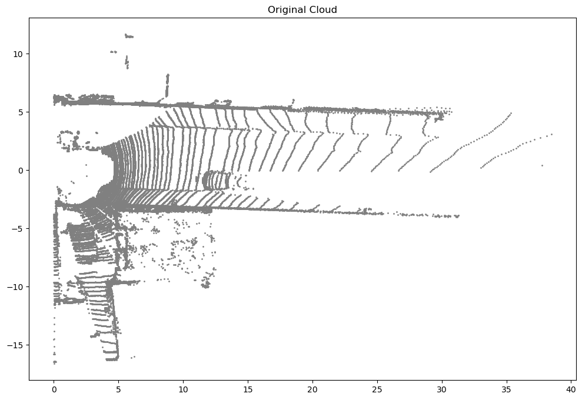
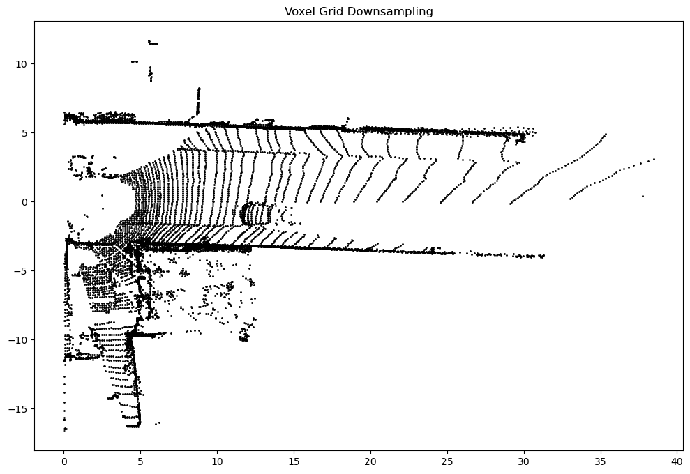
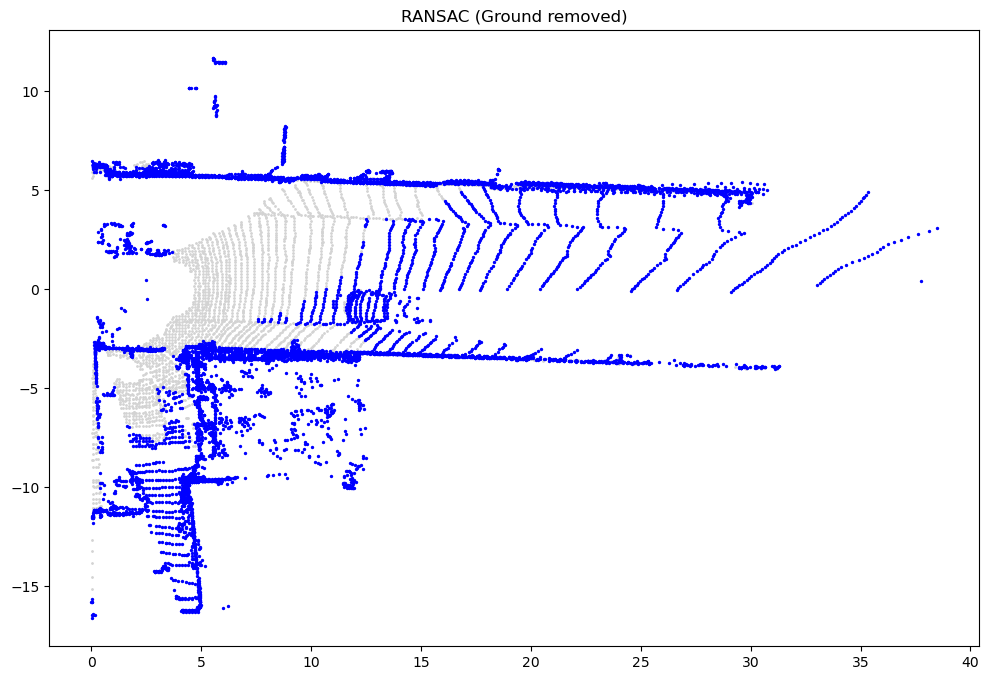
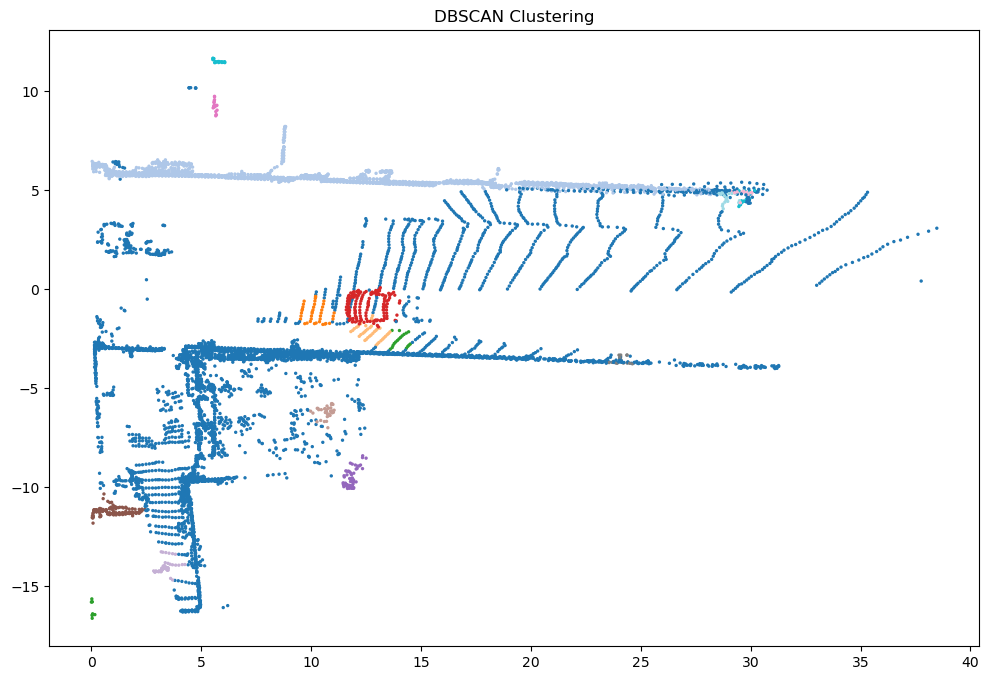
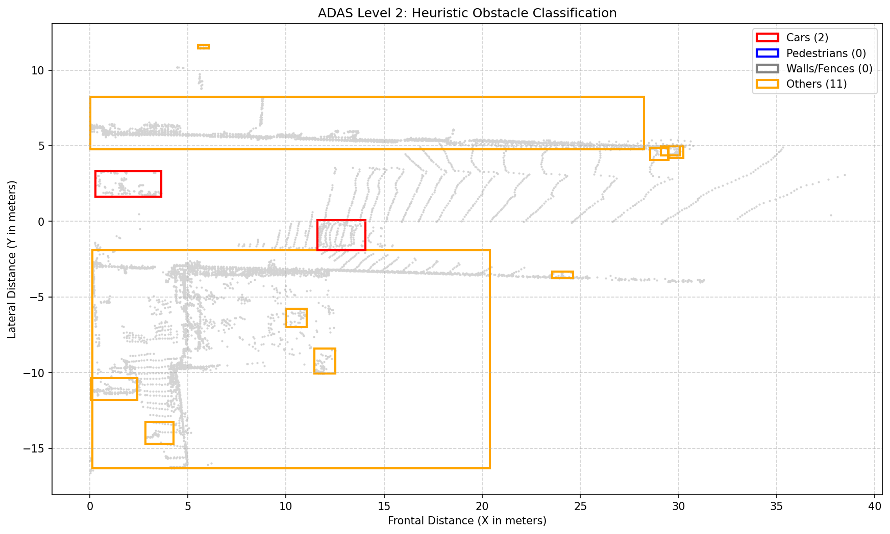
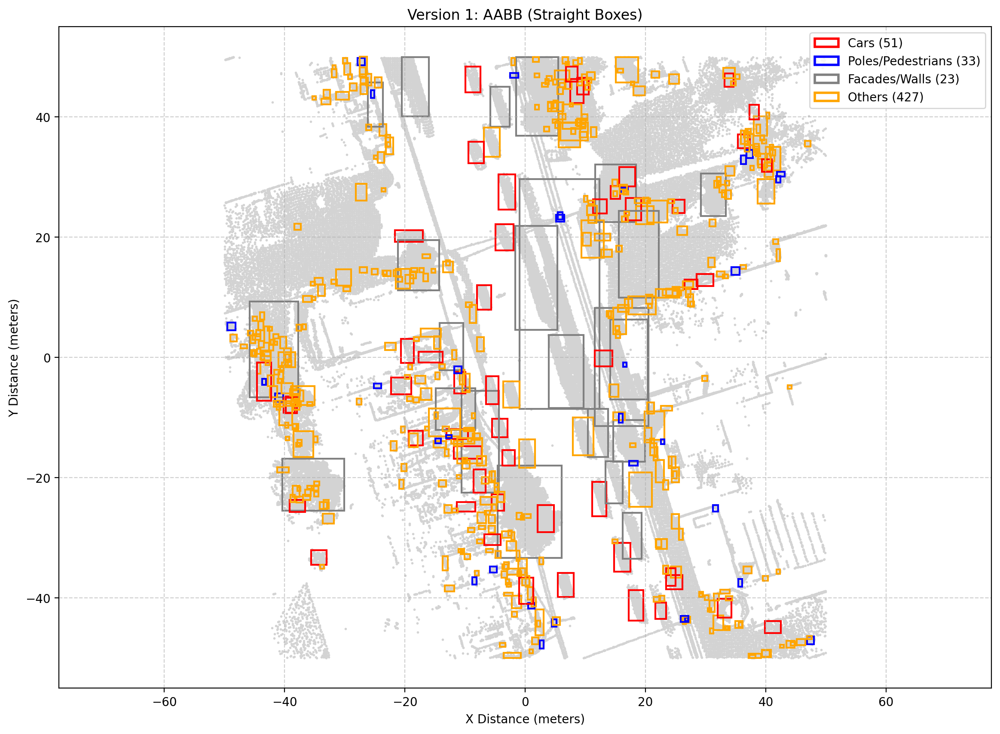
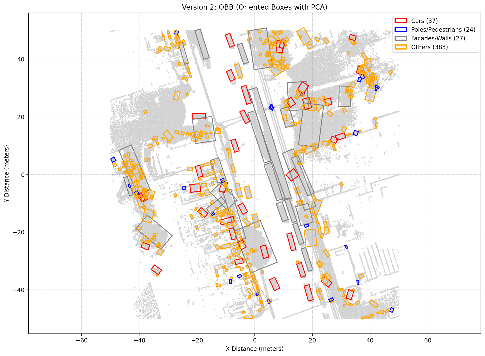

# LiDAR Point Cloud Fundamentals

This repository contains a full 3D perception pipeline I developed to process raw LiDAR data into classified, actionable objects. Instead of relying on black-box Deep Learning models, I built this pipeline using deterministic spatial geometry and computer vision algorithms.

The project demonstrates how to ingest, filter, segment, and classify millions of 3D data points to build the foundational spatial awareness required for Advanced Driver Assistance Systems (ADAS).

## Datasets Handled

To ensure the robustness of my algorithms, I tested the pipeline against two distinctly different environments:

1. **Generic PLY PointClouds:** Initial baseline testing for Open3D familiarization.
2. **KITTI Dataset:** Ego-vehicle perspective (a scanner mounted on a moving car looking forward).
3. **Toronto-3D Dataset:** Urban mapping perspective (high-density, large-scale city scans).

---

## Part 1: Introduction to Open3D

As an initial exploratory phase, I familiarized myself with Open3D's core functionalities and point cloud data structures. This allowed me to establish a baseline understanding of 3D spatial representations before moving on to complex ADAS-specific datasets.

## Part 2: The Core Perception Pipeline (KITTI Dataset)

Once I was comfortable with the terminology I tried to better understand the different techniques used and focused on datasets related to the world of ADAS.
To demonstrate the mathematical filtering process, here is the step-by-step transformation of a raw LiDAR frame from the KITTI dataset. This represents what an autonomous vehicle "sees" in real-time.

### Raw Data Ingestion

The raw `.bin` files contain thousands of unstructured points. At this stage, the system only sees depth and distance without any semantic meaning.

* **Initial Load:** 113,110 points.

### Spatial Downsampling (Voxel Grid)

Raw LiDAR sensors generate millions of points per second, which is computationally unfeasible for real-time processing.
To solve this, I implemented a **Voxel Grid filter**. By dividing the 3D space into cubic grids and approximating the points within each cube to their centroid, I drastically reduced the data load while preserving the geometric shape of the environment.

* **Performance:** Reduced from 113,110 to 29,798 points (**73.7% reduction**).

### Ground Plane Segmentation (RANSAC)

For an autonomous vehicle, the road is navigable space, not an obstacle. If left in the dataset, it bridges the gap between distinct objects.
I utilized the **RANSAC (Random Sample Consensus)** algorithm to mathematically find the largest plane in the point cloud. By iterating through random point triplets, I isolated and removed the asphalt.

* **Performance:** Removed 9,183 ground points, leaving 20,615 floating obstacle points.

### Instance Segmentation (DBSCAN)

With the ground removed, the remaining points float in 3D space. I applied **DBSCAN (Density-Based Spatial Clustering of Applications with Noise)** to group these points into individual objects based purely on spatial density.

* **Performance:** Detected **50 discrete clusters** in the forward-facing field of view.

### Heuristic Classification

To give semantic meaning to the detected clusters, I extracted the spatial dimensions (Length, Width, Height) of each object. I built a rule-based heuristic classifier that categorizes objects based on their physical volume.

In this sample test, the pipeline successfully filtered the 50 clusters and outputted the following classification:

> `Results: {'Cars': 2, 'Pedestrians': 0, 'Walls': 0, 'Others': 11}`

---

## Part 3: Scaling & Overcoming Edge Cases (Toronto-3D Dataset)

After validating the core pipeline, I scaled the algorithms to process a massive urban environment. This required handling millions of points and addressing the geometric limitations of standard bounding boxes.

### Performance at Scale

Applying the same pipeline to the Toronto-3D dataset yielded the following metrics:

* **Voxel Downsampling:** Reduced the initial 39,721,590 points down to 522,156 points (**98.7% reduction** in memory footprint).
* **RANSAC:** Successfully identified and removed 109,670 ground points, leaving 412,486 floating obstacle points.
* **DBSCAN Clustering:** Detected **1,975 distinct clusters** across the urban sector.

### The Problem: AABB vs. OBB

During this urban mapping phase, I encountered a classic geometric problem: **Axis-Aligned Bounding Boxes (AABB)** are highly inefficient for objects positioned diagonally to the coordinate system. An AABB drawn around a diagonally parked car becomes excessively large, often swallowing nearby pedestrians or streetlights.

To solve this, I engineered **Oriented Bounding Boxes (OBB)** using **Principal Component Analysis (PCA)**.

### My PCA Implementation:

1. I extracted the X and Y coordinates of each clustered object.
2. I calculated the **covariance matrix** of these points to understand their spatial distribution.
3. By extracting the **eigenvectors**, I found the primary axis of variance, which mathematically represents the exact heading (yaw angle) of the vehicle or wall.
4. I applied an inverse rotation matrix to align the points, calculated the tightest possible bounding box, and then rotated the box back into the real-world space.

**The Result:** A significant increase in bounding box accuracy, especially in curved urban environments where vehicles and structures are not aligned to a strict grid.

---

## Tech Stack

* **Language:** Python
* **3D Processing:** Open3D
* **Math & Geometry:** NumPy, Linear Algebra (PCA, Covariance, Rotation Matrices)
* **Visualization:** Matplotlib

## How to Run

1. Clone this repository.
2. Install dependencies: `pip install open3d numpy matplotlib kagglehub`
3. Run the KITTI pipeline: `python kitti/kitti_pipeline.py`
4. Run the Toronto pipeline: `python toronto/toronto_pipeline.py`

---